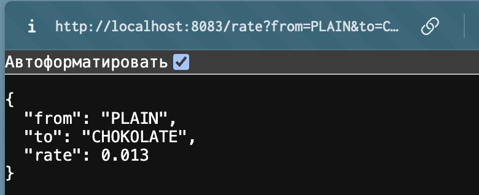
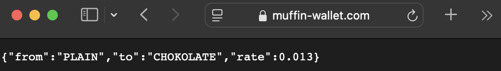

1. Создаю чарт командой
```
helm create muffin-currency
```
2. Обновляю `values.yaml`, `deployment.yaml`, `service.yaml`, чтобы они соответствовали манифестам `deployment` и `service` [отсюда](https://raw.githubusercontent.com/adan1lov/muffin-currency/refs/heads/main/k8s.yaml)
3. Запускаю миникуб
```
minikube start
```
4. Разворачиваю
```
helm install muffin-currency ./muffin-currency
```
5. Проверяю, что поды поднялись
```
kubectl get pods
```
6. Пробрасываю порты, чтобы проверить в браузере
```
kubectl port-forward svc/muffin-currency 8083:8083
```
7. Перехожу по http://localhost:8083/rate?from=PLAIN&to=CHOKOLATE 

Все работает 

---
с ингрессом

пунты 1-3 из части без ингресса
4. обновляю `ingress.yaml`
5. создаю секрет в кубере
```
kubectl create secret tls muffin-wallet-tls --cert=muffin-wallet.crt --key=muffin-wallet.key
```
6. 
```
sudo minikube tunnel
```
7. разворачиваю
```
helm install muffin-currency ./muffin-currency
```
8. перехожу по https://muffin-wallet.com/rate?from=PLAIN&to=CHOKOLATE
9. работает
