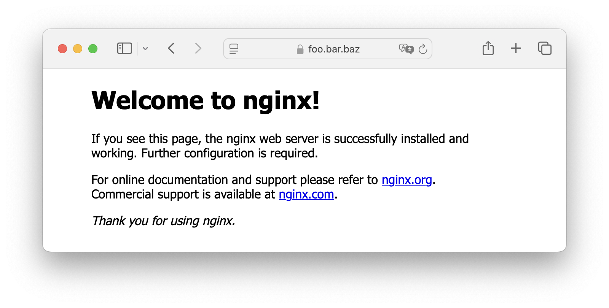

1. Необходимо создать папку `/opt/homebrew/etc/nginx/certs` и добавить в нее файлы `server.crt`, `server.key`, `ca.crt`, `client.crt`, `client.key`
2. В корневой папке выполняем `cat /opt/homebrew/etc/nginx/certs/server.crt /opt/homebrew/etc/nginx/certs/ca.crt > /opt/homebrew/etc/nginx/certs/chain.pem`
3. `sudo chmod 600 /opt/homebrew/etc/nginx/certs/server.key`
4. В файл `/opt/homebrew/etc/nginx/nginx.conf` нужно добавить блок 
```
server {
        listen       443 ssl;
	http2 on;
        server_name  foo.bar.baz;

        ssl_certificate      certs/chain.pem;
        ssl_certificate_key  certs/server.key;

	ssl_client_certificate certs/ca.crt;
	ssl_verify_client on;
	ssl_verify_depth 2;
	ssl_trusted_certificate certs/ca.crt;
	
	ssl_protocols TLSv1.2 TLSv1.3;

        location / {
            root   html;
            index  index.html index.htm;
        }
    }
```
5. `sudo sh -c 'echo "127.0.0.1 foo.bar.baz" >> /etc/hosts'`
6. Дальше открываем связку ключей, нажимаем "Система", переходим во вкладку "Сертификаты" и перетаскиваем туда `ca.crt`
7. Двойной клик по появившейся строке, разворачиваем блок "Доверие", ставим "Всегда доверять" в "Параметры использования сертификата"
8. Чтобы Safari мог использовать клиентский сертификат, надо его конвертнуть в p12 в терминале командой `openssl pkcs12 -export -in /opt/homebrew/etc/nginx/certs/client.crt -inkey /opt/homebrew/etc/nginx/certs/client.key -out /opt/homebrew/etc/nginx/certs/client.p12 -name "client"`. Два раза вводим Export Password (у меня 1234567890)
9. Двойной клик по файлу `/opt/homebrew/etc/nginx/certs/client.p12`, вводим тот же Export Password, теперь клиентский сертификат добавился в связку ключей
10. Запускаем nginx сервер
```
sudo nginx -t
brew services start nginx
```
11. Открываем Safari, заходим на `https://foo.bar.baz`, выбираем клиентский сертификат и видим
