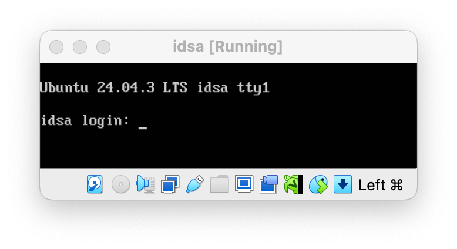
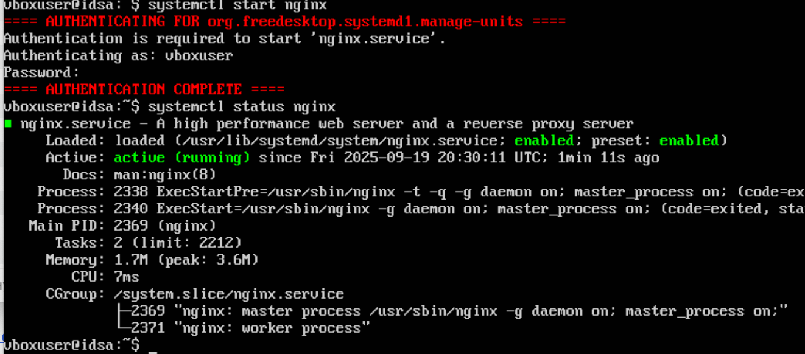
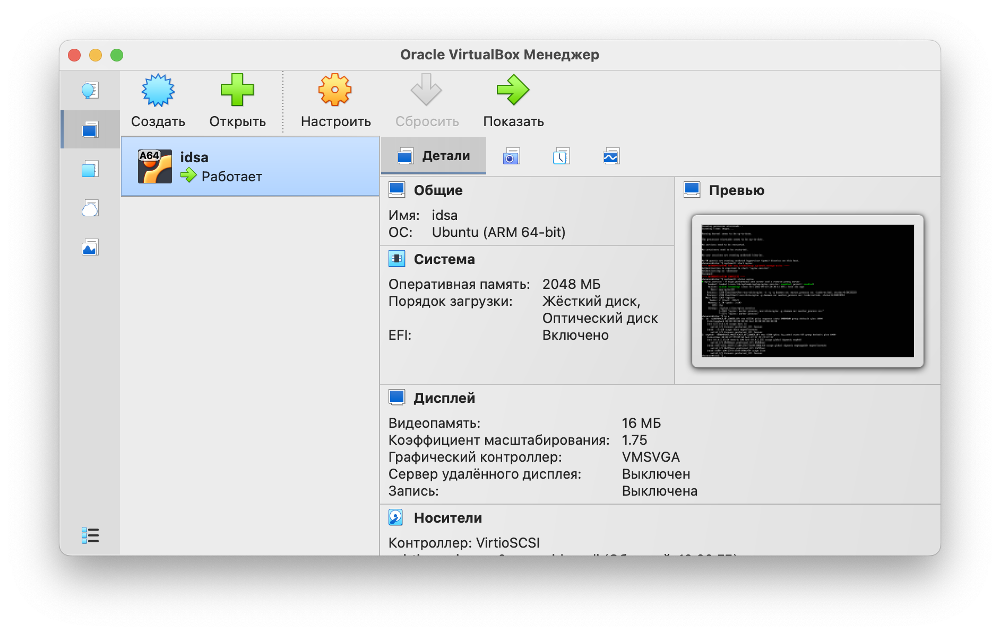
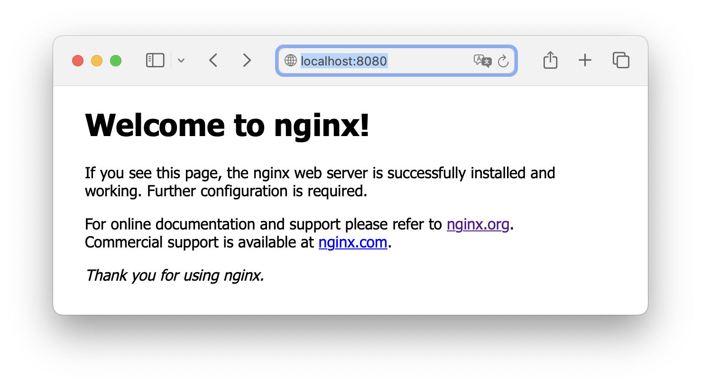
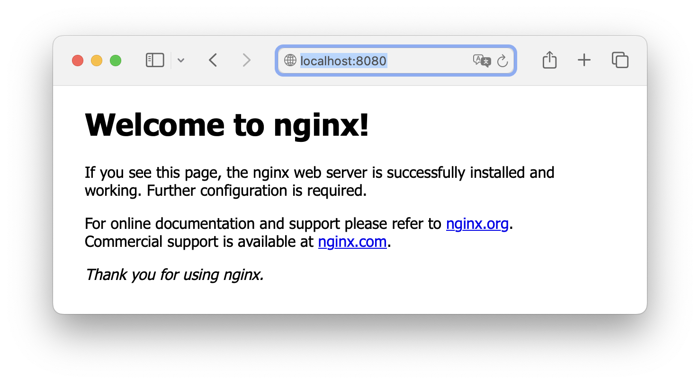

# Задание 2
## Создать вм с nginx
1. Скачиваем VirtualBox и [Ubuntu Server iso LTS](https://ubuntu.com/download/server/arm)
2. Открываем VirtualBox и нажимаем `создайте новую виртуальную машину (ВМ)`
3. Придумываем вм название, выбираем скачанный файл с образом убунту, нажимаем `Далее`
4. Запоминаем или меняем логин. Придумываем пароль и вводим его в поля `Пароль` и `Подтвердите пароль`, нажимаем `Далее`
5. Устанавливаем значения ресурсам. Я поставила 2048 мб оперативки, 1 цпу и размер диска 10 гб. Нажимаем `Далее`
6. В открывшемся окне виртуалки выбираем `Try or install ubuntu server`, нажимаем `Enter` и долго ждем, пока ubuntu поставит себе ядро
7. Авторизируемся в этом окне под логином и паролем из пункта 4: 
8. Обновляем систему
```
sudo apt update && sudo apt upgrade -y
```
Подтверждаем действие все тем же паролем из пункта 4 

9. Ставим nginx
```
sudo apt install nginx -y
```
10. Запускаем nginx и подтверждаем действие паролем из пункта 4
```
systemctl start nginx
```
11. Проверяем, что все работает (тоже с паролем)
```
systemctl status nginx
```

12. Смотрим IP виртуалки
```
ip a
```
13. В этом окне  нажимаем `Настроить` -> `Расширенные` -> `Сеть` -> `Проброс портов`
14. Нажимаем на зеленый плюсик и заполняем:
```
Адрес хоста: [IP из пункта 12, который указан в 1 inet]
Порт хоста: 8080
Порт гостя: 80
```
15. Заходим на `http://localhost:8080` и видим 
## Создать контейнер с nginx
0. Запускаем docker engine
1. Открываем терминал и пишем туда команду скачивания официального образа nginx c docker hub:
```
docker pull nginx
```
2. Запускаем контейнер с названием `idsa-nginx` на портах 8080:80
```
docker run --name idsa-nginx -p 8080:80 -d nginx
```
3. Если мы заходим в докер десктоп и видим это 
А потом в браузере по `http://localhost:8080/` видим это 
То контейнер с nginx запустился
## Подключить pgadmin к postgres
0. Запускаем docker engine
1. В терминале по адресу папки `task2` прописываем команду запуска контейнеров
```
docker-compose up -d
```
2. Открываем pgadmin командой
```
open localhost:8080
```
3. Входим по почте `idsa@hse.ru` и паролю `admin`
3. Нажимаем `Add new server`, устанавливаем в поля `Connection host name`, `port`, `maintenance`, `username` и `password` значения `postgres`, `5432`, `db`, `idsa`, `admin`
4. Создаем таблицу 
```
create table test_table(
    field1 int,
    field2 varchar(50)
)
```
5. Для проверки, что данные сохраняются при удалении контейнеров заходим в Docker Desktop, удаляем контейнеры. После этого заходим в терминал и повторяем пункт 1 данного раздела для повторного запуска контейнеров. Заходим в pgadmin и видим, что таблица на месте